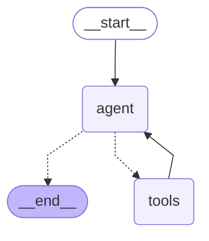

# SalesPilot — Orquestrador de Funil de Vendas (CRM Inteligente)


Agente de IA colaborativo que auxilia equipes de vendas a gerenciar leads, validar condições comerciais em tempo real e automatizar o registro de etapas do funil de vendas — tudo via linguagem natural no terminal.

---

## O que é o SalesPilot?

O SalesPilot é um **agente ReAct** (Reasoning + Acting) construído com [LangGraph](https://langchain-ai.github.io/langgraph/) que age como um parceiro estratégico do vendedor. Antes de aprovar qualquer operação comercial, ele:

- Consulta o estoque para garantir que o produto está disponível
- Valida se o desconto solicitado respeita a política da empresa (máximo 15%)
- Atualiza o status do lead no funil de vendas somente após as validações acima

O agente mantém o histórico da conversa durante toda a sessão, permitindo um diálogo contínuo e contextualizado.

---

## Como funciona — Ciclo ReAct

O grafo implementa o padrão clássico **Reasoning → Acting**:



| Fase | Nó | O que acontece |
|---|---|---|
| **Reasoning** | `agent` | O LLM recebe o histórico + system prompt, raciocina e decide quais ferramentas chamar. Emite `tool_calls` se precisar de dados. |
| **Acting** | `tools` | `ToolNode` executa a ferramenta solicitada e devolve o resultado como `ToolMessage`. O ciclo recomeça até a resposta final. |

**Exemplo de fluxo** para *"Fechar notebook com 10% de desconto para Ana Souza"*:
1. `[RACIOCÍNIO]` → chama `consultar_estoque("notebook")` → 10 unidades disponíveis
2. `[RACIOCÍNIO]` → chama `validar_regra_negocio(valor, 10.0)` → APROVADO
3. `[RACIOCÍNIO]` → chama `atualizar_lead("Ana Souza", "Fechado")` → atualizado
4. `[RACIOCÍNIO]` → resposta final ao vendedor → `END`

---

## Estrutura do projeto

```
SalesPilot-Agent-AI/
├── requirements.txt          # Dependências Python
├── .env.example              # Template de configuração do ambiente
├── .gitignore
└── salespilot/
    ├── __init__.py           # Re-exporta `app` para uso externo
    ├── tools.py              # Três ferramentas @tool + dados fake
    ├── agent.py              # LLM factory, SYSTEM_PROMPT, grafo LangGraph
    └── main.py               # Loop interativo via terminal (app.stream)
```

---

## Ferramentas do agente

| Ferramenta | Parâmetros | Comportamento |
|---|---|---|
| `consultar_estoque` | `produto: str` | Retorna a quantidade em estoque. Indica "SEM ESTOQUE" se zerado. |
| `validar_regra_negocio` | `valor_venda: float`, `desconto_percentual: float` | Aprova automaticamente descontos ≤ 15%. Acima disso, exige aprovação do supervisor. |
| `atualizar_lead` | `nome_cliente: str`, `novo_status: str` | Registra a mudança de estágio no funil. Auto-cria o lead se não existir. |

**Estágios do funil:** `Prospecção → Qualificação → Proposta → Negociação → Fechado → Perdido`

---

## Instalação

**Pré-requisitos:** Python 3.11+ e [Ollama](https://ollama.com) instalado localmente (ou uma chave de API da OpenAI).

```bash
# 1. Clone o repositório
git clone https://github.com/seu-usuario/SalesPilot-Agent-AI.git
cd SalesPilot-Agent-AI

# 2. Crie e ative um ambiente virtual
python -m venv .venv
source .venv/bin/activate   # Windows: .venv\Scripts\activate

# 3. Instale as dependências
pip install -r requirements.txt

# 4. Configure o ambiente
cp .env.example .env
# Edite o .env se quiser usar OpenAI (veja seção "Troca de modelo")
```

---

## Como executar

```bash
# Suba o Ollama com o modelo llama3.2 (em outro terminal)
ollama pull llama3.2
ollama serve

# Inicie o SalesPilot
python -m salespilot.main
```

**Saída esperada no terminal:**

```
╔══════════════════════════════════════════════════════╗
║          SalesPilot — Assistente de Vendas IA        ║
║  Digite sua mensagem. 'sair' ou Ctrl+C para encerrar ║
╚══════════════════════════════════════════════════════╝

Vendedor: Quero fechar um notebook com 10% de desconto para Ana Souza

--- SalesPilot processando ---

  [RACIOCÍNIO] Chamando ferramenta: consultar_estoque
               Argumentos: {'produto': 'notebook'}

  [FERRAMENTA] Produto 'notebook': 10 unidades disponíveis.

  [RACIOCÍNIO] Chamando ferramenta: validar_regra_negocio
               Argumentos: {'valor_venda': 3500.0, 'desconto_percentual': 10.0}

  [FERRAMENTA] APROVADO. Desconto de 10.0% dentro do limite (15.0%). Valor final: R$ 3.150,00.

  [RACIOCÍNIO] Chamando ferramenta: atualizar_lead
               Argumentos: {'nome_cliente': 'Ana Souza', 'novo_status': 'Fechado'}

  [FERRAMENTA] Lead 'Ana Souza' atualizado: 'Prospecção' → 'Fechado'.

  [RACIOCÍNIO] Tudo certo! Venda do notebook aprovada com 10% de desconto...

-----------------------------
```

---

## Visualizar o grafo

O script `generate_diagram.py` gera o diagrama do grafo LangGraph em três formatos:

```bash
# Instale a dependência para o diagrama ASCII (uma vez só)
pip install grandalf

# Gere o diagrama
python generate_diagram.py
```

| Saída | Formato | Como visualizar |
|---|---|---|
| Terminal | ASCII | Exibido direto no terminal |
| `salespilot_graph.mmd` | Mermaid | Abra no VS Code com a extensão **Mermaid Preview**, ou cole em [mermaid.live](https://mermaid.live) |
| `salespilot_graph.png` | PNG | Requer internet — gerado automaticamente via mermaid.ink API |

---

## Troca de modelo

A troca entre Ollama e OpenAI não requer nenhuma mudança de código — apenas variáveis de ambiente:

| Provedor | Configuração no `.env` |
|---|---|
| Ollama llama3.2 (padrão) | `MODEL_PROVIDER=ollama` (ou omitir) |
| Outro modelo Ollama | `MODEL_PROVIDER=ollama` + `OLLAMA_MODEL=mistral` |
| OpenAI GPT-4o-mini | `MODEL_PROVIDER=openai` + `OPENAI_API_KEY=sk-...` |
| Outro modelo OpenAI | `MODEL_PROVIDER=openai` + `OPENAI_MODEL=gpt-4o` |

---

## Exemplos de uso

### Cenário 1 — Produto sem estoque (bloqueio)
```
Vendedor: Quero vender um celular para Carlos Lima com 5% de desconto
SalesPilot: Produto 'celular' está SEM ESTOQUE no momento. Não é possível
            prosseguir com esta venda. Deseja verificar outro produto?
```

### Cenário 2 — Desconto acima do limite (requer supervisor)
```
Vendedor: Quero dar 20% de desconto no notebook para Beatriz Melo
SalesPilot: O desconto de 20% excede o limite de 15% permitido para aprovação
            autônoma. Esta venda REQUER APROVAÇÃO DO SUPERVISOR antes de ser
            confirmada.
```

### Cenário 3 — Fluxo completo aprovado
```
Vendedor: Fecha negócio do teclado com 12% de desconto para Rafael Torres
SalesPilot: Tudo verificado e aprovado! Estoque OK (30 un.), desconto de 12%
            dentro do limite. Rafael Torres atualizado para 'Fechado' no funil.
```

---

## Stack técnica

| Tecnologia | Versão | Papel |
|---|---|---|
| [LangGraph](https://langchain-ai.github.io/langgraph/) | ≥ 0.2 | Orquestração do grafo ReAct (StateGraph, ToolNode, tools_condition) |
| [LangChain Core](https://python.langchain.com/) | ≥ 0.3 | Mensagens, ferramentas (@tool), abstrações de LLM |
| [langchain-ollama](https://pypi.org/project/langchain-ollama/) | ≥ 0.2 | Integração com modelos locais via Ollama |
| [langchain-openai](https://pypi.org/project/langchain-openai/) | ≥ 0.2 | Integração com a API da OpenAI |
| [python-dotenv](https://pypi.org/project/python-dotenv/) | ≥ 1.0 | Carregamento de variáveis de ambiente |
| Python | 3.11+ | Linguagem base |

---

## Licença

MIT © 2026 Felipe Oliveira
